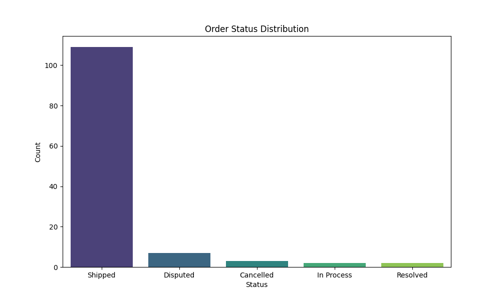
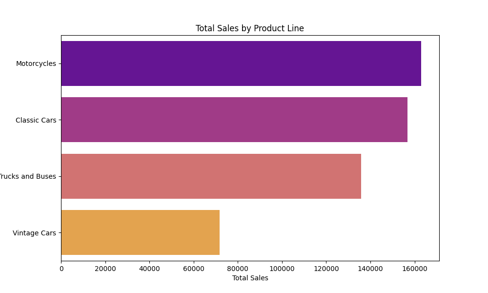
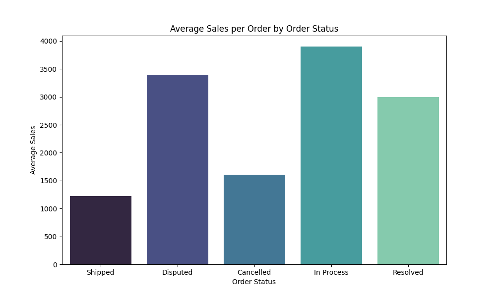
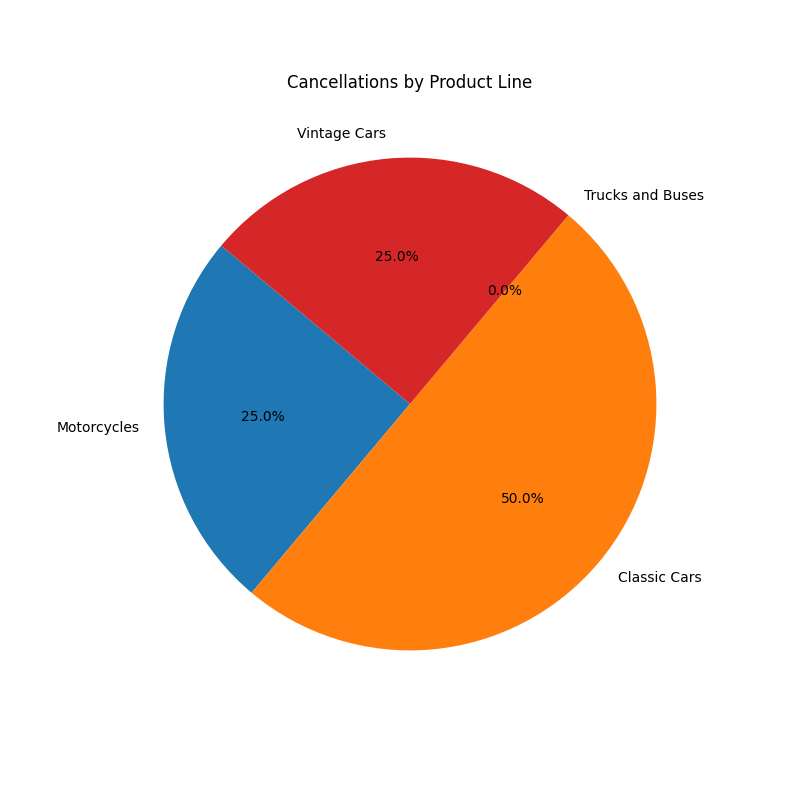
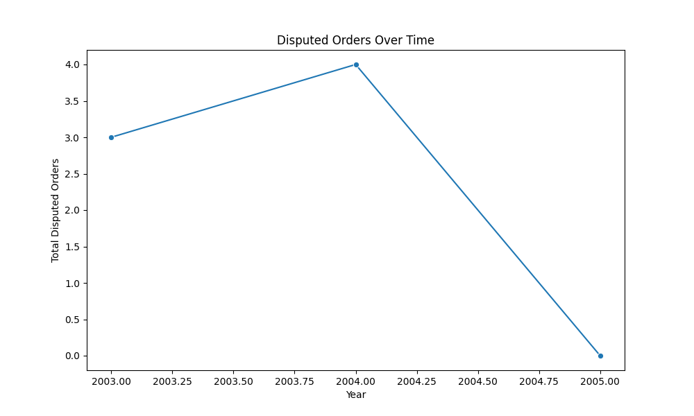

**Final Report: Support System Insights**

---

### Key Findings

#### Order Status Distribution
| Status     | Count     |
|------------|-----------|
| Shipped    | 109       |
| Disputed   | 7         |
| Cancelled  | 3         |
| In Process | 2         |
| Resolved   | 2         |

*Chart: Order Status Distribution*  

#### Order Quantity by Product Line
| Product Line      | Total Orders | Total Quantity | Average Quantity per Order |
|------------------|--------------|----------------|----------------------------|
| Motorcycles      | 50           | 1231           | 24.62                      |
| Classic Cars     | 51           | 1242           | 24.35                      |
| Trucks and Buses | 51           | 1170           | 22.98                      |
| Vintage Cars     | 51           | 827            | 16.24                      |

#### Total Sales by Product Line
| Product Line      | Total Sales ($) |
|------------------|------------------|
| Motorcycles      | 162,970.42       |
| Classic Cars     | 156,734.90       |
| Trucks and Buses | 135,880.56       |
| Vintage Cars     | 71,812.86        |

*Chart: Total Sales by Product Line*  

---

### Performance Insights

#### Average Sales per Order
| Order Status | Average Sales ($) |
|--------------|--------------------|
| Shipped      | 1,224.64           |
| Disputed     | 3,398.71           |
| Cancelled    | 1,600.76           |
| In Process   | 3,901.60           |
| Resolved     | 3,000.20           |

*Chart: Average Sales per Order by Order Status*  

#### Cancellations by Product Line
| Product Line  | Total Cancellations |
|---------------|----------------------|
| Motorcycles   | 1                    |
| Classic Cars  | 2                    |
| Trucks and Buses  | 0                |
| Vintage Cars  | 1                    |

*Chart: Cancellations by Product Line*  

---

### Satisfaction or Feedback Trends

#### Disputed Orders Over Time
| Year | Total Disputed Orders |
|------|-----------------------|
| 2003 | 3                     |
| 2004 | 4                     |
| 2005 | 0                     |

*Chart: Disputed Orders Over Time*  

---

### Suggested Actions
1. **High Volume of "Disputed" Orders**: Improve billing clarity and customer service response times.
2. **Inconsistent Shipping Times**: Analyze shipping logistics, and implement proactive tracking mechanisms.
3. **High Rate of Small Orders with Medium Margins**: Introduce volume discounts and promote product bundles.
4. **Cancellation of Orders**: Collect feedback on cancellations to identify areas for improvement in the purchasing experience.
5. **Underperformance in Specific Territories**: Tailor marketing strategies to meet local market needs and engage local partners.
6. **Repeated Returns of Products**: Investigate return reasons, enhance product descriptions, and improve customer education.
7. **Limited Engagement with Large Deal Sizes**: Assign dedicated account managers for targeted outreach to large clients.
8. **Low Sales in Certain Product Lines**: Conduct market research to phase out underperforming products and prioritize trending ones.
9. **Unexplained Variations in Sale Prices**: Implement consistent pricing strategies across platforms to stabilize customer perception.

---

This report synthesizes the performance of the support system, presenting data-driven insights to guide decision-making on future strategies for improvement and customer satisfaction.